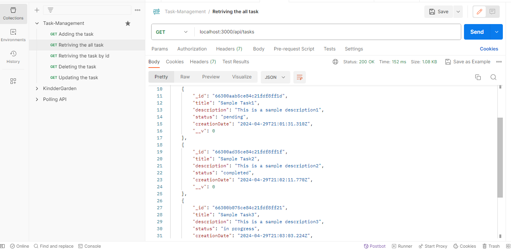
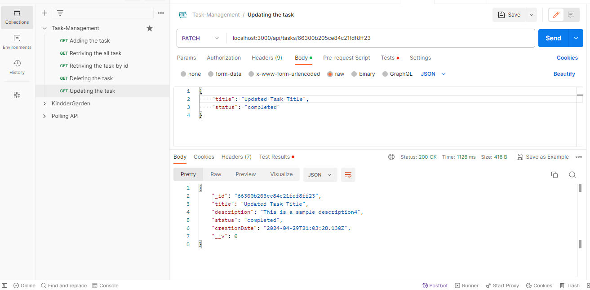
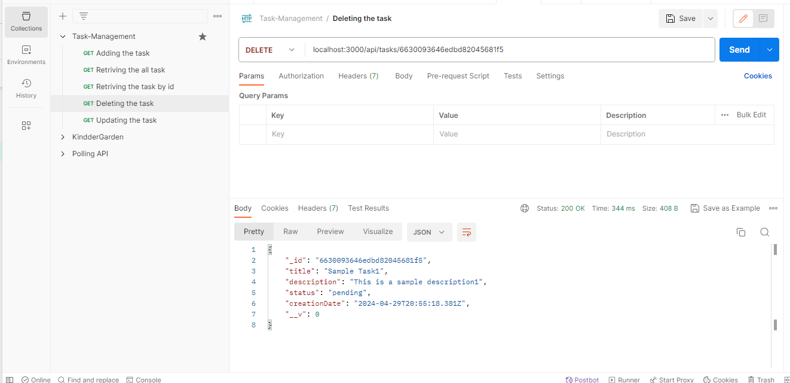

# Task Management API

<p align="justify">✍This project is a simple Task Management API built using Express.js and MongoDB. It provides basic CRUD functionalities for managing tasks.</p>

## Prerequisites

Before you begin, ensure you have met the following requirements:
- You have installed Node.js and npm.
- You have a MongoDB instance running locally or remotely and accessible via a connection string.

## Installing Task Management API

To install the Task Management API, follow these steps:

1. Clone the repository:
   ```bash
   git clone https://github.com/yourgithub/task-management-api.git
   ```

2. Navigate to the project directory:  
   ```bash
   cd write-your-projext-name
   ```

3. Install the required npm packages:
   ``` bash
   npm install
   ```

## Folder Structure
- #### config
   - ###### mongoose.js
- #### models
   - ###### tasks.js
- #### routes
   - ###### taskRoutes.js
- #### tests
   - ###### task.test.js
- #### index.js
- #### package.json
- #### README.md


## Configuring the Environment

Create a `.env` file in the root of your project and add the following environment variables:

- **PORT=3000** 
- **NODE_ENV=development**
- **MONGODB_URL=mongodb://localhost:27017/taskdb**


## Running the Application
- To start the application, run:
```bash
  npm your-root-file-name
```

## API Endpoints

- The application provides the following RESTful endpoints:

- **POST /api/tasks**
   - Creates a new task.
   - Request body should include id, title, description, status.
   
   - ###### Created task1
   - 

   - ###### Created task2
   - 

   - ###### Created task3
   - 

- **GET /api/tasks**
   - Retrieves all tasks.
   - 

- **GET /api/tasks/:id**
   - Retrieves a task by its id
   - 

- **PATCH /api/tasks/:id**
   - Updates a task by its id
   - Request body may contain any of title, description, status.
   - 

- ***DELETE /api/tasks/:id***
   - Deletes a task by its id
   - 


## Handling Errors
<p align="justify">The API uses standard HTTP status codes to indicate the success or failure of an API request. Errors are returned in JSON format.</p>


## Testing
- Run tests:
```bash
  npm test
```

## Contributing
- To contribute to this project, follow these steps:
   - 1. Fork the repository.
   - 2. Create a branch: git checkout -b <branch_name>. by default main
   - 3. Make your changes and commit them: git commit -m '<commit_message>'.
   - 4. Push to the original branch: git push origin <project_name><location>.
   - 5. Create the pull request.


#### **Note:** Alternatively, see the GitHub documentation on creating a pull request.